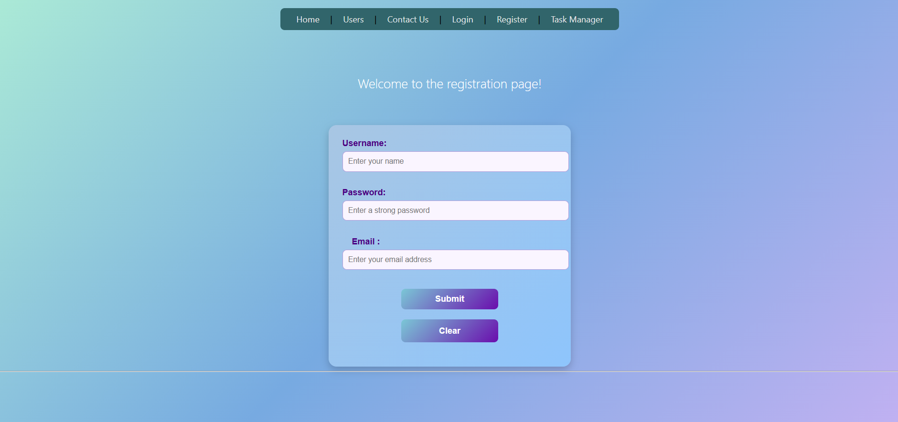
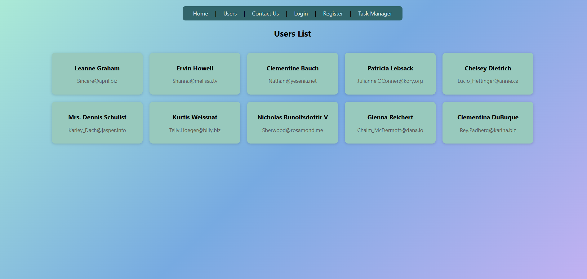
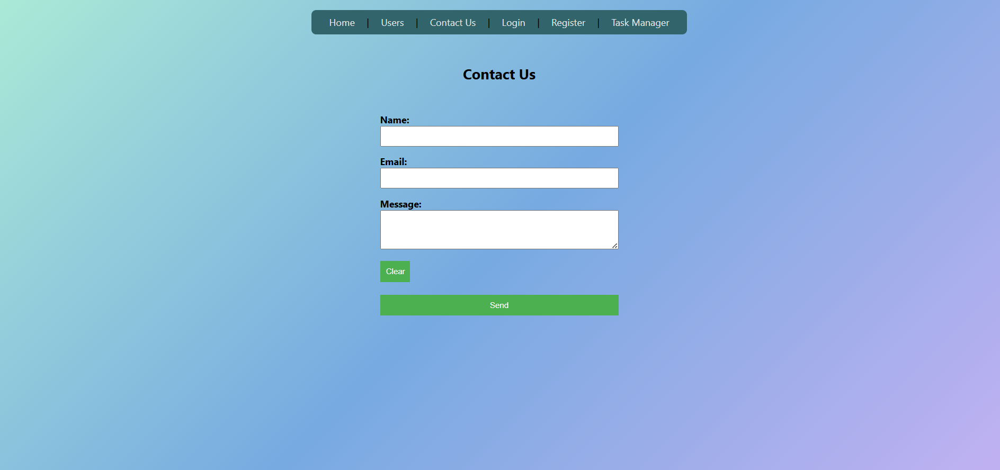
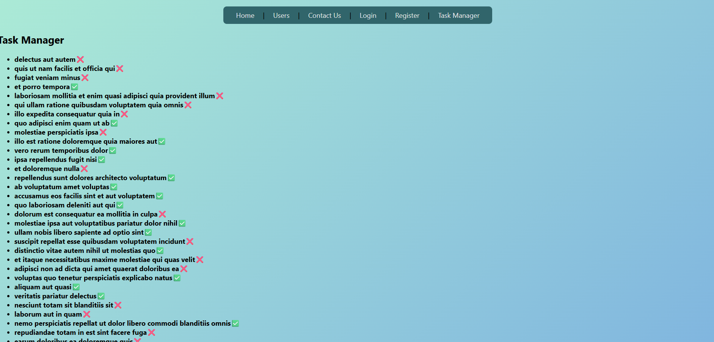

Angular Internship Project

Project Overview: This is an Angular application built during my Full-Stack internship. The project demonstrates practical Angular skills including forms, routing, API consumption, services, and component-based architecture. The app simulates a user management system with login, registration, users list, user details, contact, and a task manager.

🛠️ Technologies & Skills Used:

Angular (16+) TypeScript Standalone Components Angular Router & Routing Reactive Forms (FormGroup, FormBuilder) Template-driven forms (NgForm, ngModel) Validators & Custom Validation Services & Dependency Injection Observables (HttpClient + .subscribe())

API integration: https://jsonplaceholder.typicode.com/users https://jsonplaceholder.typicode.com/todos

HTML & CSS Structural directives: *ngIf, *ngFor Event binding (click) & two-way binding [(ngModel)]

🚀 Features 1️⃣ Login Page

Built using Reactive Forms

Form fields: username, password

Form validation: Required fields Minimum password length Login logic handled by Master service Alerts on successful or failed login

Skills demonstrated: FormGroup and FormBuilder Reactive form validation Service injection Template binding and event handling

2️⃣ Register Page

Template-driven form (NgForm)

Form fields: username, email, password

Validation includes: Required fields Minimum length Custom password rules (1 uppercase, 1 symbol, at least 3 numbers) Custom email format validation Registration logic handled by Master service Alerts on successful registration Clear form functionality Skills demonstrated: Template-driven forms Two-way binding [(ngModel)] Custom validation methods in TypeScript Dependency injection

3️⃣ Master Service

Handles core logic for user management

Methods: registerUser(user: User) → stores a user in a private array loginUser(username, password) → checks credentials getUsers() → fetches users from JSONPlaceholder API

Skills demonstrated: TypeScript interfaces Dependency injection Observables HttpClient usage Local in-memory data handling

API usage: https://jsonplaceholder.typicode.com/users

4️⃣ Users Page 

Fetches list of users from API (getUsers() from Master service)

Displays user cards with name and email

Each user links to /users/:id page

Skills demonstrated: *ngFor directive Async data handling via Observables RouterLink for dynamic navigation

API usage: https://jsonplaceholder.typicode.com/users

5️⃣ User Details Page

Dynamic route /users/:id

Reads ID from URL using ActivatedRoute

Fetches full list of users from API and finds user by ID

Displays user info: name, username, email, phone, website

Shows loading template while waiting for API response

Skills demonstrated: Dynamic routing with parameters ActivatedRoute usage Conditional template rendering (*ngIf + ng-template) Observable subscription

API usage: https://jsonplaceholder.typicode.com/users

6️⃣ Contact Us Page

Form fields: name, email, message

Buttons: Submit + Clear

submitContact() logs values to console and displays alert

Clears the form after submission

Skills demonstrated: Template-driven forms Two-way binding Event handling

7️⃣ Task Manager Page

Fetches tasks from JSONPlaceholder API

Displays tasks with title and completed status

Skills demonstrated: Services with HttpClient Observables and .subscribe() Rendering list with *ngFor

API usage: https://jsonplaceholder.typicode.com/todos

